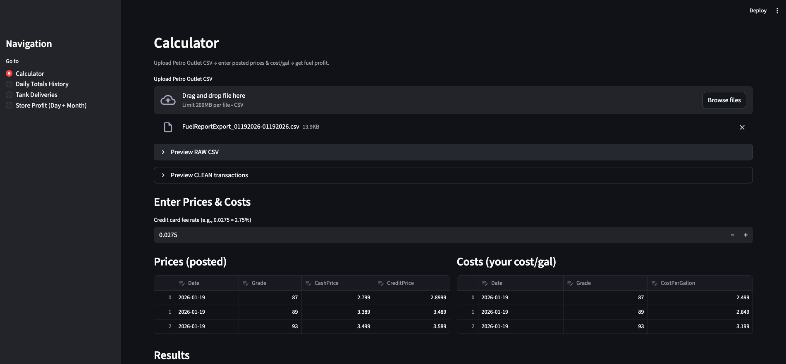
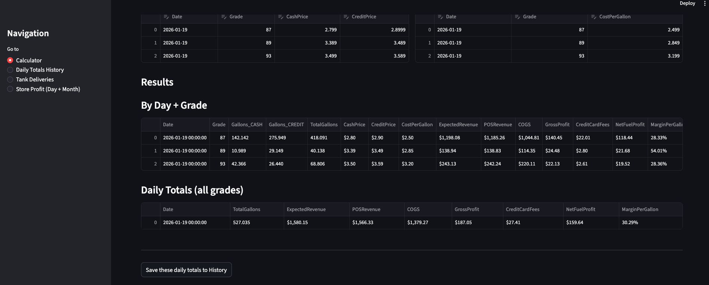
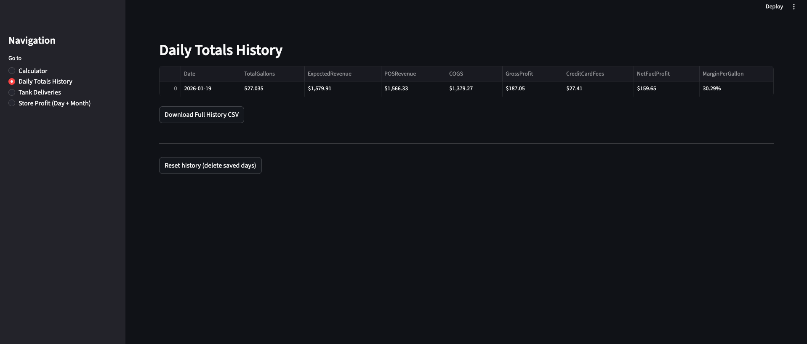
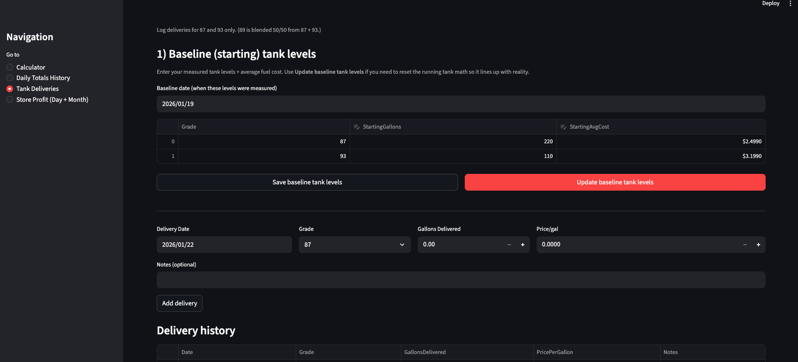

# FuelLedger — Fuel Profit Tracker

**Cash/Debit vs Credit Profitability Analysis for Gas Stations**

## Project Overview

FuelLedger is a local-first Streamlit application that tracks fuel and store profitability for gas station operators. Upload your Petro Outlet transaction CSVs, enter posted prices and costs, and instantly see detailed profit analysis by grade, payment method, and day. 

**Key benefits:**
- All data is stored locally in your workspace—no cloud connectivity or external services required
- Built with Python and Streamlit for easy deployment on any machine
- Simple, intuitive interface designed for operators and managers
- Retroactive pricing support: adjust prices after transactions have occurred

## Features

- **Upload & Parse Transactions**: Load Petro Outlet CSV exports directly; automatic validation of required columns (Date, Grade, Gallons, Amount, Tender)
- **Price & Cost Entry**: Enter cash and credit posted prices, plus per-gallon costs; apply them retroactively to past transactions using an "as-of" merge
- **Grade Breakdown**: View profit metrics for 87, 89, and 93 octane separately; 89 cost auto-calculates as the average of 87 and 93
- **Daily Totals & History**: Compute daily profit by grade and payment method (cash/debit vs credit); save summaries to persistent history
- **Credit Card Fee Calculation**: Deduct credit card processing fees from gross profit; configurable fee rate
- **Tank Deliveries Log**: Track fuel deliveries and baseline tank levels (87/93 only) to monitor inventory
- **Store Profit (Day + Month)**: Combine fuel profit with inside-store sales, COGS, and variable costs; deduct monthly fixed costs (rent, electric, etc.) for a complete P&L

## Quickstart (Local)

### Local Installation & Run

**Prerequisites:**
- Python 3.8 or higher
- A terminal / command line
- A text editor or IDE (optional)

**Step-by-step instructions:**

1. **Clone or download this repository** to your machine:
   ```bash
   cd /path/to/gas-profit-app
   ```

2. **Create a Python virtual environment**:
   ```bash
   python -m venv .venv
   ```

3. **Activate the virtual environment**:
   - **macOS / Linux:**
     ```bash
     source .venv/bin/activate
     ```
   - **Windows:**
     ```bash
     .venv\Scripts\activate
     ```

4. **Install required packages**:
   ```bash
   pip install -r requirements.txt
   ```

5. **Optionally install streamlit-aggrid** for a better grid interface:
   ```bash
   pip install streamlit-aggrid
   ```

6. **Run the app**:
   ```bash
   streamlit run app.py
   ```

The app will automatically open in your browser at `http://localhost:8501`. If it doesn't, visit that URL manually.

### Test with Sample Data

To explore FuelLedger without real data, use the provided sample CSV in the `data_samples/` folder:

```bash
# See data_samples/README.md for step-by-step testing instructions
cat data_samples/README.md
```

The sample includes 12 test transactions across 2 dates and 3 grades (87, 89, 93) with mixed payment types (cash, debit, credit).

## Data Storage & Local Files

### Where Your Data Lives

All user data is persisted locally in the `.fuel_profit_data/` directory, created automatically when you first run the app:

| File | Purpose |
|------|---------|
| `daily_totals_history.csv` | Cumulative daily profit totals (all grades) |
| `fixed_costs.csv` | Monthly fixed costs (rent, utilities, etc.) |
| `store_daily.csv` | Daily inside-store sales, COGS, and variable costs |
| `tank_baseline.csv` | Starting tank levels and average costs (grades 87/93) |
| `tank_deliveries.csv` | Fuel delivery log |

**Data Safety:**
- `.fuel_profit_data/` is gitignored, so it will not be committed to version control
- **Back up your data regularly** by copying the `.fuel_profit_data/` folder to a secure location
- No data is sent to any cloud service—everything stays on your computer

## CSV Input Expectations

FuelLedger expects a **Petro Outlet transaction export** with these columns:

| Column | Type | Notes |
|--------|------|-------|
| `Date Sold` | Date (any format, auto-coerced) | Sale date; will be normalized to YYYY-MM-DD |
| `Grade Name` | String | Must be one of: `REGUNL` (87), `PLSUNL` (89), `SUPUNL` (93) |
| `Gallons Sold` | Numeric | Total gallons in transaction |
| `Final Amount` | Numeric | Total sale amount ($) |
| `Primary Tender Code` | String | Payment type: `cash`, `debitCards`, `creditCards`, etc. |

Transactions with unrecognized grades or missing dates are automatically filtered out.

## How Calculations Work (High Level)

### Step 1: Transaction Aggregation
Raw transactions are grouped by **date + grade + payment tier (cash/credit)** to produce daily summaries with total gallons and revenue.

### Step 2: Posted Price Application
For each sale date and grade, the app finds the **most recent posted price and cost on or before that date** (as-of merge). This allows you to price transactions retroactively or adjust prices mid-day.

### Step 3: Profit Calculation
- **Expected Revenue** = (Gallons_CASH × Cash Price) + (Gallons_CREDIT × Credit Price)
- **COGS** = Total Gallons × Cost/Gallon
- **Gross Profit** = Actual POS Revenue − COGS
- **Credit Card Fees** = (Gallons_CREDIT × Credit Price) × Fee Rate (e.g., 2.75%)
- **Net Fuel Profit** = Gross Profit − Credit Card Fees
- **Margin / Gallon** = Net Fuel Profit ÷ Total Gallons
- **Revenue Variance** = Actual POS Revenue − Expected Revenue (detects discrepancies)

### Step 4: Grade Blending (89 Octane)
Grade 89 is a blend of 87 and 93; cost is auto-calculated as the simple average of 87 and 93 costs for any given day. Tank tracking uses 87/93 only; 89 volumes are inferred from the blend ratio.

### Step 5: Store & Fixed Cost Integration
Inside-store sales and costs are combined with fuel profit, and monthly fixed costs are allocated evenly across all days in the month.

## Screenshots

### Calculator Overview


Upload a Petro Outlet CSV, enter posted prices for cash and credit, and compute fuel profit with automatic credit card fee deduction.

### Daily Results by Grade


View profit metrics broken down by date, grade (87/89/93), and payment method, including gross profit, margin per gallon, and revenue variance.

### Daily Totals History


Access a complete history of all saved daily totals with download and reset options for record-keeping and auditing.

### Tank Deliveries


Log fuel deliveries and manage baseline tank levels to track inventory and align tank math with physical measurements.

## Deploying to Streamlit Cloud (Optional)

If you want to host FuelLedger on a shared server or cloud, you can use **Streamlit Cloud** (free tier available):

1. Push this repository to GitHub
2. Sign up for [Streamlit Cloud](https://streamlit.io/cloud)
3. Deploy your repository and configure the data storage (`.fuel_profit_data/`) as a persistent directory

**Important for cloud deployment:**
- Consider adding user authentication if this will be shared
- Set up regular backups of `.fuel_profit_data/` to prevent data loss
- Review Streamlit Cloud's pricing and limitations for production use

For most use cases, running locally (as described above) is simpler and keeps data entirely private.

## Troubleshooting

### `streamlit: command not found`
Ensure your virtual environment is activated:
```bash
source .venv/bin/activate  # macOS / Linux
.venv\Scripts\activate     # Windows
```
Then install Streamlit:
```bash
pip install -r requirements.txt
```

### `ModuleNotFoundError: No module named 'st_aggrid'`
The `streamlit-aggrid` package is optional. The app will work without it (using plain Streamlit dataframes). To install:
```bash
pip install streamlit-aggrid
```
Then restart Streamlit (`Ctrl+C`, then `streamlit run app.py`).

### Date Mismatch or Unexpected Totals
- Verify the `Date Sold` column in your CSV is parsed correctly (check the "Preview RAW CSV" section in the Calculator page)
- Check that prices and costs are entered for **all dates and grades** in your transaction set
- If tank math doesn't line up, ensure baseline tank levels are set correctly in the "Tank Deliveries" page
- Use the "Daily Totals History" page to spot-check calculations against your expected numbers

### Column Name Errors
Ensure your CSV has **exact** column names (case-sensitive):
- `Date Sold`
- `Grade Name`
- `Gallons Sold`
- `Final Amount`
- `Primary Tender Code`

If column names don't match, the app will show a clear error listing the missing columns.

## Development & Contributing

- **No automated tests**: Validation is manual. Test changes by exercising the Calculator → Daily Totals → Store Profit workflows.
- **Code style**: Python, 4-space indentation, PEP 8 conventions. No linter configured; keep diffs clean.
- **Single-file architecture**: All logic and UI live in `app.py` (~900 lines); keep related functions close together.

For development guidelines and AI agent instructions, see [.github/copilot-instructions.md](.github/copilot-instructions.md).

## License

_(Add your license here, e.g., MIT, Apache 2.0, or proprietary.)_

## Support

For issues, feature requests, or questions, please open an issue in this repository.
